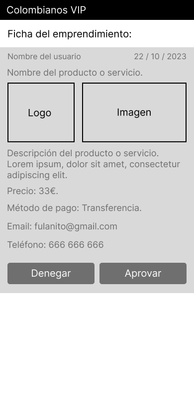

<div align="center"></div>

----

## <div align="center"> Our motto: 'A qué esperas para crear y compartir tu emprendimiento/producto?'</div>

We have developed this marketplace framed in the category of services for Colombian society, helping them to upload businesses or products on our website.

***

This project is part of the F5's final project. We have two weeks to create a marketplace with the following guidelines:
## 1. COLOMBIA SHOP MARKETPLACE
- What kind of content are you going to have in it?
- Who is your target audience?
- How are you going to improve people's lives?

## 2. MAKE A GOOD DESIGN
## 3. SHAPE THE CONTENT OF YOUR CARDS
- Which attributes does your card have?
- Which values could those attributes take?
- Which attributes are mandatory and which ones aren't?

## 4. ADD BASIC FUNCTIONALITY
- Homepage with card lists
- Show view of a specific card

## 5. ADD EXTRA FUNCTIONALITIES
- Contact form to be in touch with the company
- Search bar
- About us
- Contact the client

***

## Table of contents
* [Team Members](#team-members)
* [Screenshots](#screenshots)
* [Technologies](#stacks)
* [Installation](#how-to-install-this-project)
* [Methodology](#methodology)
* [Next Steps](#next-steps)

***

## Team Members

| Name | Role |  |
| :---: | :---: | :---: |
| Francisco Aguirre |  Scrum Master | https://github.com/Uxoa |
| Albert Arqués | Product Owner| https://github.com/mintybubblegum |
| Guillem Martínez | Developer | https://github.com/guillemmj33 |
| Alejandro Buritica | Developer | https://github.com/JaumeViBu |
| Cristian Calderón | Developer | https://github.com/cristiancalderon |

***

## Screenshots

<div style="heigth:auto; display:flex; flex-wrap:wrap; justify-content:center; padding:1rem">

|   Mobile home view sketch   |   Mobile show view sketch   |   Mobile home mockup   |   Mobile show mockup   | 
| --- | --- | --- | --- |
  
|  |  |  |  |
| --- | --- | --- | --- |

</div>


***

## Stacks

- HTML 5
- CSS 3
- Tailwind CSS
- PHP 8.1.10
- React JS
- Laravel Framework 9.44.0
- Stripe
- MySQL
- Axios
***

## How to install this project

You will need a text editor and perform the following steps:

1. Clone the project, frontend and backend
```bash
  https://github.com/albertarques/colombia-shop-front.git
```
```bash
  https://github.com/albertarques/colombia-shop-back.git
```

2. Go to the project directory
```bash
  cd colombia-shop-front
```
```bash
  cd colombia-shop-back
```

3. Start MySQL service and create a MySQL database named "colombia-shop"

4. Create in the text editor an .env file by copying the contents of .env.example and modify the database name (colombia-shop by colombia-shop)

5. Install dependencies
```bash
  npm install
```
```bash
  composer install
```

6. Activate the server and keep this terminal open
```bash
  npm run dev
```

7. Run the PHP server and keep this terminal open
```bash
  php artisan serve
```

8. Migrate database
```bash
  php artisan migrate:fresh --seed
```

***

***

## Methodology
- TDD
- Agile with SCRUM
- Pair and solo programming
***

## Next Steps
(in development)


